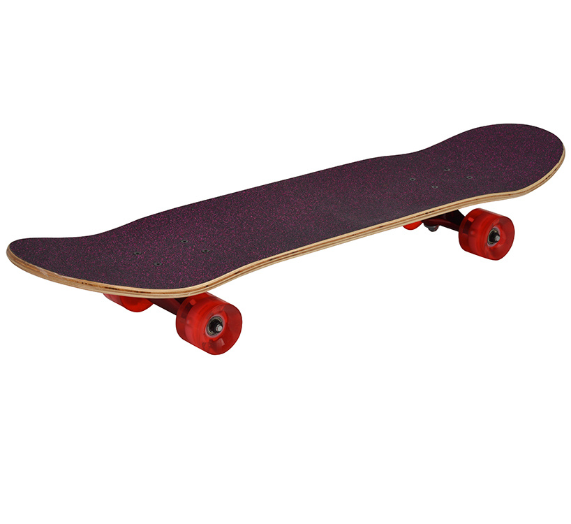

# Documentation example post

This is an example post to demonstrate how to add documentation to the project.

Simply add a new folder under `posts`, and name the folder the name of your post.

Under this folder, create an `assets` folder, in which you can include any assets (documents, files, images etc.) which you can link to in your post.

---

This is an example for using assets:



---

Example code block: (C#)
```c#
class FooClass {
    public string name;

    public FooClass() {
        this.name = "foo";
    }
}
```